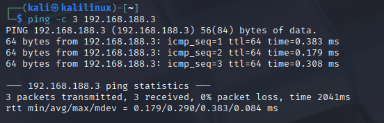

# Phase 1 - Mise en place du lab

## Objectif
Monter deux machines virtuelles isolées : un attaquant et une cible,
sur un réseau coupé d'Internet et du réseau personnel.

## Architecture
- **Hyperviseur** : VirtualBox (Windows 11, host)
- **Réseau** : Host-Only #2 — 192.168.188.0/24, DHCP activé, aucun accès Internet
- **Kali Linux** (attaquant) — 192.168.188.4
- **Metasploitable 2** (cible vulnérable) — 192.168.188.3

## Isolement
Les deux VM sont sur le même réseau Host-Only, sans adaptateur NAT.
Metasploitable n'est jamais exposée au réseau physique.

## Validation
Ping de Kali vers la cible : 3/3 paquets reçus, 0% de perte.

## Schéma
[Kali 192.168.188.4] <---- réseau isolé 192.168.188.0/24 ----> [Metasploitable 192.168.188.3]
