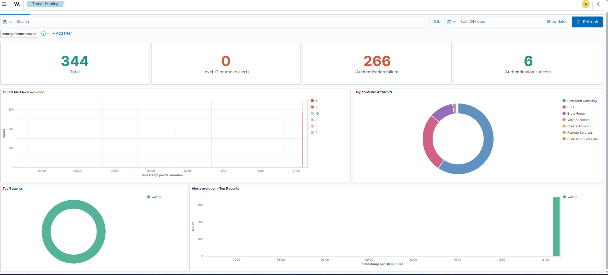

# Phase 3 - Détection (Blue Team)

## Objectif
Déployer un SIEM (Wazuh) et vérifier qu'il détecte une attaque réelle
lancée depuis le lab.

## Architecture
- VM dédiée Ubuntu Server 24.04 (192.168.188.5), 4 Go RAM, 2 CPU
- Wazuh 4.9.2 installé en all-in-one (manager + indexer + dashboard)
- Le manager surveille les logs de sa propre machine (auth.log, etc.)

## Scénario d'attaque
Depuis Kali (192.168.188.4), brute-force SSH contre le serveur Wazuh :
    hydra -l ismail -P rockyou.txt ssh://192.168.188.5 -t 1

## Détection obtenue
Dans Wazuh > Threat Hunting :
- 266 événements "Authentication failure" en quelques minutes
- Pic d'activité clairement visible sur la timeline
- Classification automatique MITRE ATT&CK : Brute Force (T1110),
  Password Guessing, SSH

## Lecture
Le SIEM transforme des centaines de lignes de logs brutes en une alerte
lisible et catégorisée. C'est ce qui permet à un analyste de réagir vite.

## Remédiation (côté défense)
- Limiter les tentatives SSH (fail2ban, MaxAuthTries)
- Désactiver l'authentification par mot de passe (clés SSH uniquement)
- Changer le port SSH par défaut, restreindre par pare-feu
- Mettre en place des alertes temps réel sur seuil d'échecs

## Réponse automatique : fail2ban

### Objectif
Passer de la détection à la réaction : bannir automatiquement une IP qui
tente un brute-force SSH.

### Mise en place (sur le serveur 192.168.188.5)
    sudo apt install fail2ban
Config dans /etc/fail2ban/jail.local :
    [sshd]
    enabled = true
    backend = systemd
    maxretry = 3
    findtime = 600
    bantime = 600

### Test
Brute-force relancé depuis Kali (192.168.188.4) avec hydra.
Après 3 échecs, fail2ban a banni l'IP automatiquement :
    Currently banned: 1
    Banned IP list: 192.168.188.4
(voir screenshots/phase3-fail2ban.png)

### Lecture
Wazuh détecte et classe l'attaque, fail2ban la bloque en temps réel.
Les deux sont complémentaires : visibilité + réaction automatique.

### Remédiation complète recommandée
- Authentification SSH par clés (désactiver les mots de passe)
- Changer le port SSH par défaut
- fail2ban en complément pour les tentatives résiduelles