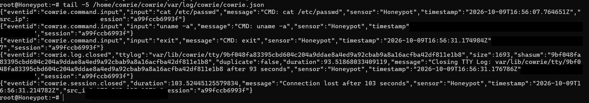

# Phase 4 - Honeypot (Cowrie)

## Objectif
Exposer un leurre SSH sur Internet pour capturer et analyser les
attaques automatisées réelles.

## Infrastructure
- VPS Hetzner Cloud (CAX11, Ubuntu 22.04, Nuremberg)
- Cowrie v2.5.0 installé sous un utilisateur non-privilegie (securite)
- Cowrie écoute sur le port 2222
- SSH d'administration déplacé sur le port 2244
- Redirection iptables : port 22 (public) -> 2222 (Cowrie)

## Fonctionnement
Cowrie imite un serveur SSH vulnérable (faux Debian). Les attaquants
qui "entrent" évoluent dans un faux système isolé pendant que chaque
action est enregistrée (connexions, identifiants testés, commandes,
fichiers téléchargés).

## Données collectées
- Logs texte et JSON structuré (var/log/cowrie/)
- Enregistrement TTY rejouable de chaque session
- Pour chaque événement : IP source, horodatage, identifiants, commandes

## Test de validation
Connexion depuis mon poste sur le port 22 -> redirigée vers Cowrie.
Faux shell obtenu, commandes enregistrées 

## Analyse (à venir)
Après plusieurs jours de collecte : top IP sources, pays d'origine,
mots de passe les plus tentés, commandes exécutées, classement MITRE ATT&CK.

## Remédiation / bonnes pratiques
- Un honeypot s'isole du réseau de production (ici un VPS dédié)
- On observe uniquement, jamais de contre-attaque (cadre légal)
- SSH d'admin sur port non-standard + clés SSH recommandées